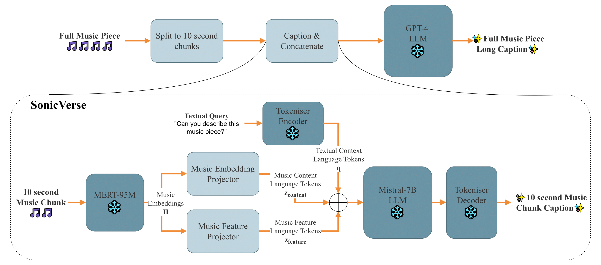

<div align="center">

# **SonicVerse: Multi-Task Learning for Music Feature-Informed Captioning**
[](https://arxiv.org/abs/2506.15154)
[](https://huggingface.co/amaai-lab/SonicVerse)
[](https://huggingface.co/spaces/amaai-lab/SonicVerse)
[](https://amaai-lab.github.io/SonicVerse/)

</div>

## Overview

SonicVerse is a multi-task music captioning model that integrates caption generation with auxiliary music feature detection tasks such as key detection, vocals detection, and more. The model directly captures both low-level acoustic details as well as high-level musical attributes through a novel projection-based architecture that transforms audio input into natural language captions while simultaneously detecting music features through dedicated auxiliary heads. Additionally, SonicVerse enables the generation of temporally informed long captions for extended music pieces by chaining outputs from short segments using large language models, providing detailed time-informed descriptions that capture the evolving musical narrative.

<div align="center">

<p><em>Figure 1: SonicVerse architecture for music captioning with feature detection.</em></p>
</div>

🔥 Live demo available on [Huggingface](https://huggingface.co/spaces/amaai-lab/SonicVerse)

## Key Features

- **Multi-Task Learning**: Combines caption generation with music feature detection (key detection, vocals detection, etc.)
- **Projection-Based Architecture**: Transforms audio input into language tokens while maintaining feature detection capabilities
- **Enhanced Captioning**: Produces rich, descriptive captions that incorporate detected music features
- **Long-Form Description**: Enables detailed time-informed descriptions for longer music pieces through LLM chaining

## Installation

```bash
git clone https://github.com/AMAAI-Lab/SonicVerse.git
cd SonicVerse
pip install -r requirements.txt
pip install -e .
```

### Quick App

```bash
python scripts/app.py
```

## 🛠️ How to Train Locally

```bash

# Run the training
deepspeed scripts/train_model.py \
  --model_name_or_path mistralai/Mistral-7B-Instruct-v0.1 \
  --model_cls MistralLMMForCausalLM \
  --modality_builder audio_descript \
  --train_dataset_path {path to dataset train split} \
  --evaluation_dataset_path {path to dataset val split} \
  --output_dir {path to output checkpoints directory} \
  --pretrain_projectors \
  --lora_enable True \
  --bf16 True \
  --tf32 True \
  --num_train_epochs 3 \
  --gradient_checkpointing True \
  --per_device_train_batch_size 1 \
  --per_device_eval_batch_size 1 \
  --gradient_accumulation_steps 32 \
  --model_max_length 2048 \
  --evaluation_strategy "steps" \
  --eval_steps 1300 \
  --save_strategy "steps" \
  --save_steps 450 \
  --save_total_limit 3 \
  --learning_rate 1e-4 \
  --weight_decay 0. \
  --warmup_ratio 0.03 \
  --lr_scheduler_type "cosine" \
  --dataloader_num_workers 2 \
  --logging_steps 1 \
  --use_multi_task 2 \
  --tasks_config configs/tasks.json \
  --report_to none \
  --deepspeed ./configs/zero2.json
```

Switch configs to `configs/tasks_ft.json`, for finetuning only the projector

---

<!-- ```

## Training
### Data Prcoessing
### Finetuning
 -->


## Citation

If you use SonicVerse in your work, please cite our paper:

**SonicVerse: Multi-Task Learning for Music Feature-Informed Captioning**
Anuradha Chopra, Abhinaba Roy, Dorien Herremans
Accepted to AIMC 2025

```bibtex
@article{chopra2025sonicverse,
  title={SonicVerse: Multi-Task Learning for Music Feature-Informed Captioning},
  author={Chopra, Anuradha and Roy, Abhinaba and Herremans, Dorien},
  journal={Proceedings of the 6th Conference on AI Music Creativity (AIMC 2025)},
  year={2025},
  address={Brussels, Belgium},
  month={September},
  url={https://arxiv.org/abs/2506.15154},
}
```

Read the paper here: [arXiv:2506.15154](https://arxiv.org/abs/2506.15154)
DOI: [10.48550/arXiv.2506.15154](https://doi.org/10.48550/arXiv.2506.15154)

---

## Built With

- [Hugging Face Spaces](https://huggingface.co/spaces)
- [Gradio](https://gradio.app/)
- [Mistral 7B](https://huggingface.co/mistralai/Mistral-7B-v0.1)
- [MERT 95M](https://huggingface.co/m-a-p/MERT-v1-95M)

---

<!-- ## ✨ Acknowledgements

- [Model authors or papers you built on]
- [Contributors or collaborators]

---

<div align="center">
Made with ❤️ by the AMAAI Lab | Singapore
</div>
